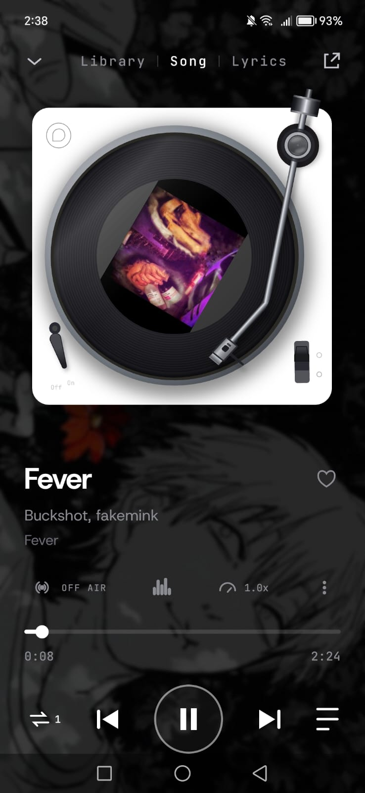
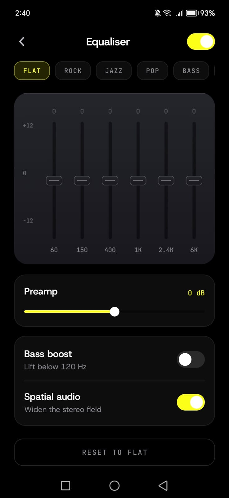
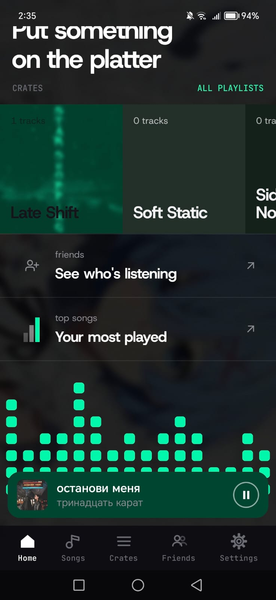
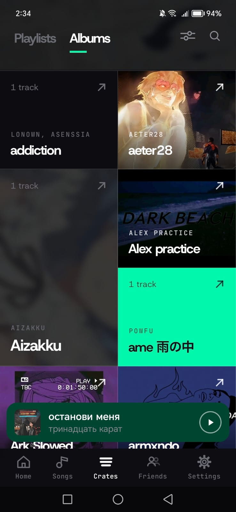
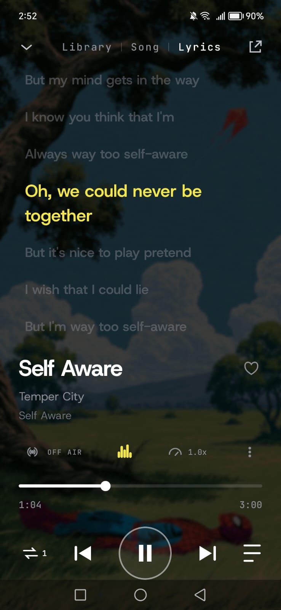
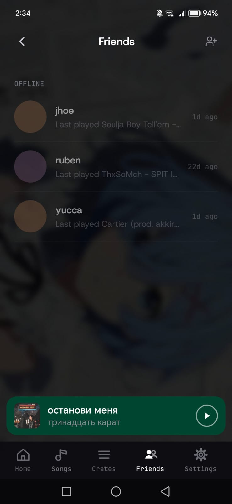
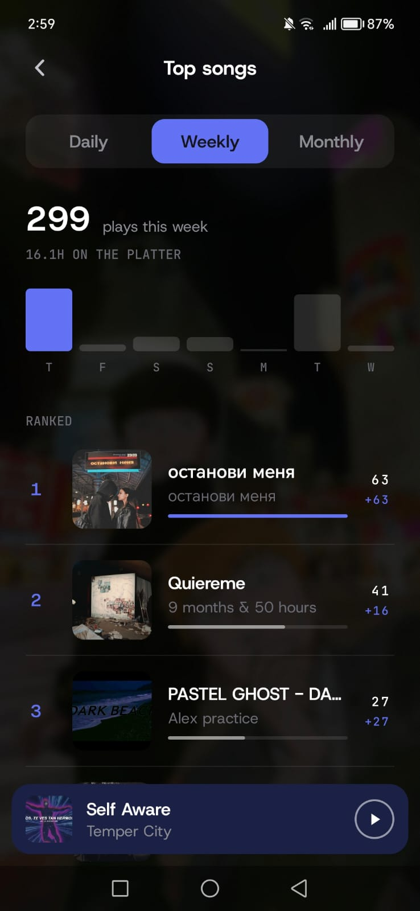
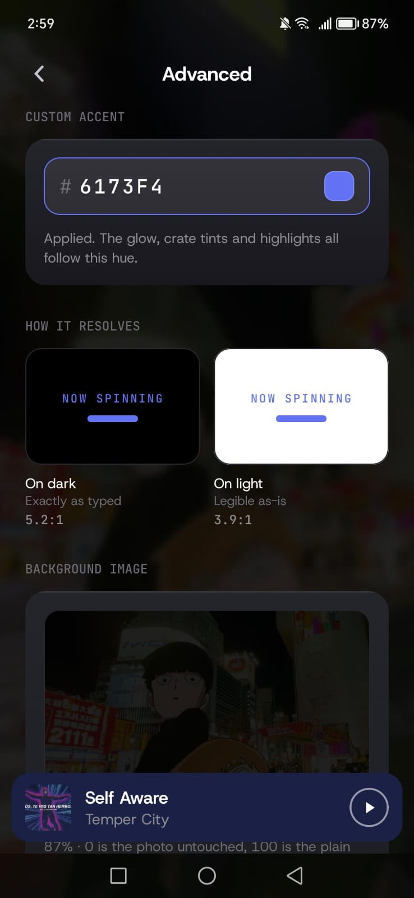

# SoundVibe

**Escucha lo que escuchas, al mismo tiempo.**

SoundVibe es una app Android que convierte tu música local en una sesión de escucha
compartida: reproduce en tu teléfono lo que ya tienes descargado y lo transmite a tus
amigos en **tiempo real**, con la interfaz, el ecualizador y la letra de la canción
sincronizados en todos los dispositivos al mismo tiempo.

No es un servicio de streaming con catálogo: el audio sale de tu teléfono. Tus amigos
solo se conectan a tu sesión, no a tu biblioteca.

---

## Qué hace

- **Sincronización en tiempo real.** Si pausas, saltas o cambias de canción, todos lo ven al
  instante. La posición del reproductor se mantiene alineada entre dispositivos.
- **Streaming local a amigos.** El audio se sirve desde el dispositivo del anfitrión hacia las
  sesiones activas, sin subir archivos a un servidor de música.
- **Letras sincronizadas.** La letra avanza junto con el audio en el teléfono de cada oyente
  (ver `screenshot_5.jpeg`).
- **Ecualizador integrado** con preajustes y ajuste por bandas (ver `screenshot_2.jpeg`).
- **Notificaciones push** para eventos de sesión: se une un amigo, empieza la música,
  alguien entra o sale de la sesión, fin de la canción, etc.
- Sesiones privadas por amigo o grupo, con lista de amigos y biblioteca local del dispositivo.

---

## Capturas de pantalla

### Reproducción



### Ecualizador



### Inicio



### Álbumes



### Letras en tiempo real



### Amigos



### Top canciones



### Personalización



---

## Stack

| Capa | Tecnología |
|------|------------|
| App Android | **Kotlin** (Android SDK, Material) |
| Lógica de sesión / streaming | **Go** (backend) |
| Sincronización de playback | Go (WebSocket) |
| Notificaciones | **Firebase Cloud Messaging (push)** |
| Persistencia local | Biblioteca multimedia del dispositivo (MediaStore) |

### Por qué este stack

- **Kotlin** para el cliente: acceso directo a MediaStore, permisos de audio en primer plano y
  bajo consumo de batería durante la transmisión.
- **Go** para el backend: baja latencia en las conexiones persistentes y buen manejo de
  conexiones largas, ideal para mantener sincronizadas las sesiones de escucha.
- **Push (FCM)**: despierta la app del oyente en background para signalling fiable, mientras que
  la sincronización fina viaja por el socket.

---

## Arquitectura

```
┌─────────────┐         ┌──────────────┐         ┌──────────────┐
│  Anfitrión  │◀───────▶│  Backend Go  │◀───────▶│   Oyente     │
│  (Kotlin)   │  audio  │  sesiones    │  audio  │  (Kotlin)    │
│  MediaStore │◀───────▶│  sync + push │◀───────▶│  FCM + UI    │
└─────────────┘         └──────────────┘         └──────────────┘
```

- El **anfitrión** publica una sesión y sirve el audio desde sus archivos locales.
- El **backend Go** gestiona las sesiones, mantiene la sala sincronizada y emite los eventos.
- El **oyente** recibe el estado del reproductor y el audio, y se actualiza en tiempo real.
- El **push** avisa a los oyentes para que abran la sesión aunque la app esté en segundo plano.

---

## Requisitos

- Android 8.0 (API 26) o superior
- Permisos de archivos de audio y notificaciones
- Cuenta de Firebase para el push (archivo `google-services.json`)

## Compilación

```bash
# App Android
./gradlew assembleDebug

# Backend
go build ./...
```

El APK de release firmado está en [`soundvibe.apk`](soundvibe.apk).

---

## Privacidad

- El audio **nunca sale de tu dispositivo** hacia un servicio de terceros: se transmite
  únicamente a las sesiones de tus amigos conectados.
- La biblioteca local solo se expone cuando tú abres una sesión; puedes cerrar la sesión en
  cualquier momento para cortar la transmisión.

## Licencia

Proyecto privado. Todos los derechos reservados.
